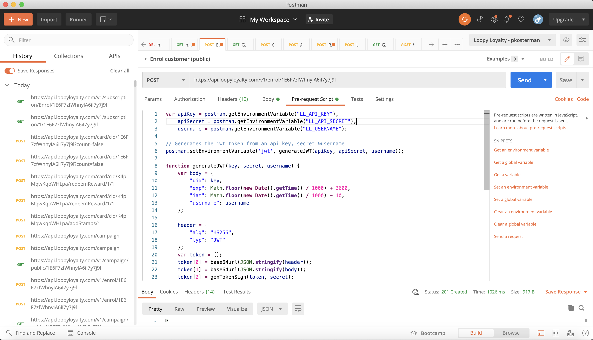
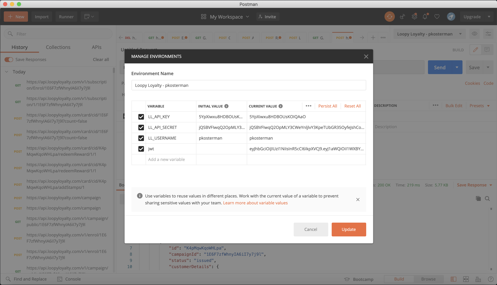
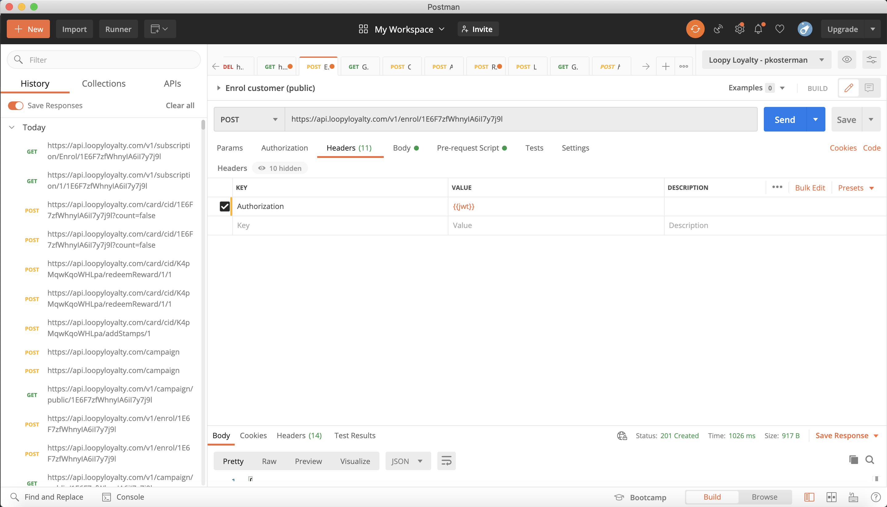
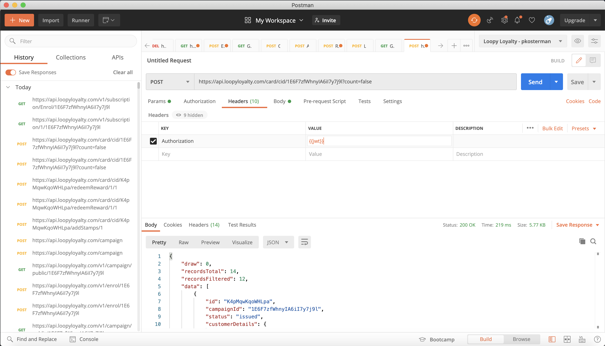

# loopy-loyalty-rest-examples
Repository contains reference files for the Loopy Loyalty API Developer Documentation:
https://developer.loopyloyalty.com

# Postman
The quickest way to get started with the API is by using our Postman Collection with the below prerequest snippet.

## Prerequest snippet
The prerequest snippet takes care of generating a JWT for you to place in the `Authorization` header:

__Step 1: Copy and paste below in the prerequest section of your request:__
```
var apiKey = postman.getEnvironmentVariable("LL_API_KEY"),
    apiSecret = postman.getEnvironmentVariable("LL_API_SECRET"),
    username = postman.getEnvironmentVariable("LL_USERNAME");

// Generates the jwt token from an api key, secret &username
postman.setEnvironmentVariable('jwt', generateJWT(apiKey, apiSecret, username));

function generateJWT(key, secret, username) {
    var body = {
        "uid": key,
        "exp": Math.floor(new Date().getTime() / 1000) + 3600,
        "iat": Math.floor(new Date().getTime() / 1000) - 10,
        "username": username
    };

    header = {
        "alg": "HS256",
        "typ": "JWT"
    };
    var token = [];
    token[0] = base64url(JSON.stringify(header));
    token[1] = base64url(JSON.stringify(body));
    token[2] = genTokenSign(token, secret);

   return token.join(".");
}

function genTokenSign(token, secret) {
    if (token.length != 2) {
        return;
    }
    var hash = CryptoJS.HmacSHA256(token.join("."), secret);
    var base64Hash = CryptoJS.enc.Base64.stringify(hash);
    return urlConvertBase64(base64Hash);
}


function base64url(input) {
    var base64String = btoa(input);
    return urlConvertBase64(base64String);
}

function urlConvertBase64(input) {
    var output = input.replace(/=+$/, '');
    output = output.replace(/\+/g, '-');
    output = output.replace(/\//g, '_');

   return output;
}
```



__Step 2: Create a new environment with your API key and Secret:__
- `LL_API_KEY`: Your API key.
- `LL_API_SECRET`: Your API secret.
- `LL_USERNAME`: Your Loopy Loyalty username (or subuser name).



__Step 3: Use `{{jwt}}` in your auth header:__



__Step 4: Execute your API call with environment set:__



## Postman Collection
[](https://app.getpostman.com/run-collection/d3d2753c6072ae2c5b18)

# REST Payloads
## Enrol customer (public)
URL:
`POST https://api.loopyloyalty.com/v1/enrol/{cid}`

Payload:
```
{
	"customerData": {
		"Name": "Patrick Kosterman",
		"Email address": "patrick@passkit.com",
		"Contact Number": "+85254632635",
		"Birthday": "1986-03-30T22:00:00.000Z"
	},
    "dataConsentOptIn": true
}
```

## Get campaign (public)
URL:
`GET https://api.loopyloyalty.com/v1/campaign/public/{cid}`

## Create campaign
URL:
`POST https://api.loopyloyalty.com/campaign`

Payload:
```
{
	"organisationName": "PassKit Inc.",
	"business": {
		"addressLine1": "Tobacco House",
		"city": "Hong Kong",
		"country": "HK",
		"email": "pkosterman@gmail.com",
		"name": "PassKit Inc.",
		"phone": "",
		"stateProvinceRegion": "-",
		"website": "https://passkit.com"
	},
	"id": "new",
	"type": "single",
	"description": "Collect stamps for cool rewards!",
	"design": {
		"backgroundColor": "#5c4da0",
		"textColor": "#ffffff",
		"iconImageId": "ll-icons/de31766e6d4f81c05afaa266bd7533b2.png",
		"logoImageId": "ll-logos/8428b05325aaf24beb906b9460c86031.png"
	},
	"baseStripImage": {
		"width": 1125,
		"height": 432,
		"padding": 40,
		"totalStamps": 10,
		"stampImage": "bagel",
		"unstampImage": "bagel",
		"backgroundColor": "#401A6B",
		"backgroundOpacity": 1,
		"stampColor": "#FFFFFF",
		"stampOpacity": 1,
		"unstampColor": "#FFFFFF",
		"unstampOpacity": 0.25,
		"placeholders": true,
		"placeholderColor": "#6B1D5E",
		"placeholderOpacity": 1,
		"placeholderBorderColor": "#177BE3",
		"placeholderBorderOpacity": 1,
		"rewardsPlaceholders": true,
		"rewardBorderColor": "#EBFF10",
		"rewardBorderOpacity": 1,
		"rewardBackgroundColor": "#808548",
		"rewardBackgroundOpacity": 1,
		"rewardPositions": 0,
		"imageType": "svg"
	},
	"terms": "1. Earn 1 stamp for every _______________ purchased.\n2. Collect __ stamps to receive a _______________ upon your next visit.\n3. This card, stamps, and rewards are valid until_______________.\n4. This card can only be used at _______________ (and _______________).\n5. Stamps and rewards cannot be exchanged, refunded, replaced or redeemed for cash.\n6. Cards are non-transferrable and cannot be combined with other cards.\n7. The Company reserve the right of final decisions in case of any disputes.",
	"collectValue": "Spend $5 to get 1 stamp.",
	"rewards": [{
		"rewardName": "Free coffee",
		"rewardText": "You will get a free coffee after collecting 8 stamps.",
		"stampLockscreenMessage": "Only {#} more stamps until your reward!",
		"rewardLockscreenMessage": "Come and get your free coffee today!",
		"stampsRequired": 10
	}],
	"links": [{
		"href": "https://loopyloyalty.com",
		"description": "Visit our website",
		"type": 0
	}],
	"fieldsToCollect": [{
		"name": "First Name",
		"type": "text",
		"required": true
	}, {
		"name": "Email Address",
		"type": "email",
		"required": true
	}, {
		"name": "Mobile Number",
		"type": "tel",
		"required": true
	}],
	"locationsText": "113 Concord Road, Wayland MA, 01778",
	"labels": [],
	"stampsRequiredForNextRewardReplacement": "stampsRequiredForNextReward",
	"consentEnabled": false,
	"consentText": "I agree that my personal data can be used and provided for direct marketing purposes in accordance with ___________________",
	"consentCheckboxEnabled": false,
	"customFrontFields": [{
		"label": "STAMPS REQUIRED UNTIL NEXT REWARD",
		"fieldToDisplay": "stampsRequiredForNextReward"
	}],
	"name": "Patrick API Demo 2",
	"status": 1
}
```

## Add stamps (by card ID)
URL:
`POST https://api.loopyloyalty.com/card/cid/{cid}/addStamps/1`

## Redeem Rewards (by card ID)
URL:
`POST https://api.loopyloyalty.com/card/cid/{cid}/redeemReward/1/1`

## List cards
URL:
`POST https://api.loopyloyalty.com/card/cid/{cid}?count=false`

Payload:
```
{
	"dt": {
		"start": 0,
		"length": 10,
		"search": "patrick",
		"order": {
			"column": "created",
			"dir": "desc"
		}
	}
}
```

## Get sample even
URL:
`GET https://api.loopyloyalty.com/v1/subscription/Enrol/{cid}`